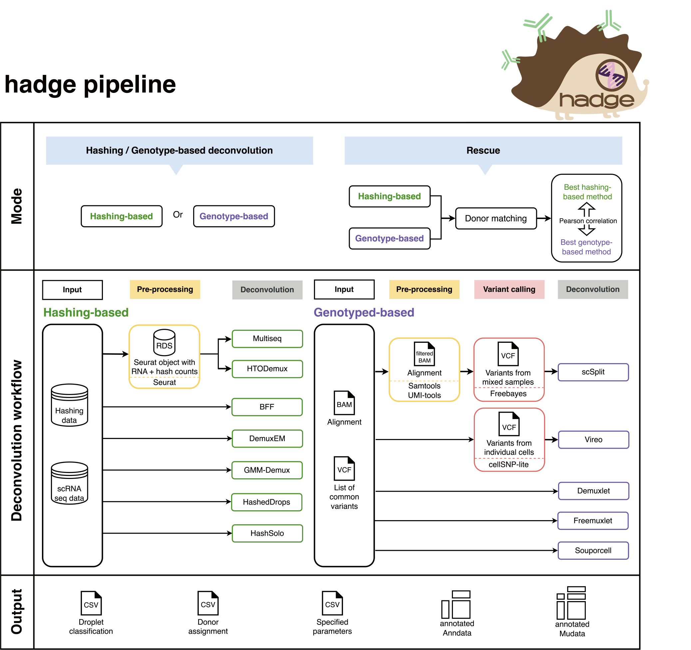

# General

## **hadge: a comprehensive pipeline for donor deconvolution in single cell**

Preprint manuscript is available [here](https://www.biorxiv.org/content/10.1101/2023.07.23.550061v2)



## **Pipeline overview:**

The mode of the pipeline is set by `params.mode`. hadge provides 4 modes in total: genetic, hashing, rescue or donor_match.

- genetic: Genetics-based deconvolution workflow (check [](genetic))
- hashing: Hashing-based deconvolution workflow (check [](hashing))
- rescue: genetic + hashing + donor matching (check [](rescue))
- donor_match: donor matching (check [](rescue))

## **Pipeline configuration**

The pipeline provides some pre-defined profiles. The standard profile is used by default when no profile is specified, where the pipeeline is run locall and all processes annotated with the big_mem label are assigned 4 cpus and 16 Gb of memory.

```
profiles{
    standard {
        process {
            executor = 'local'
            withLabel: big_mem {
                cpus = 4
                memory = 16.GB
            }
            withLabel: small_mem {
                cpus = 2
                memory = 8.GB
            }
        }

    }
```

### Conda environments:

By using the `-profile conda` option, the pipeline executes each process within a Conda environment specified in the conda directive. Alternatively, you have the flexibility to add a new profile in the `nextflow.config` file, allowing you to use local Conda environments for running processes.

```
profiles{
    my_conda_profile {
        // dont forget to enable Conda
        conda.enable = true
        process {
            // Use Conda environment files
            withName:scSplit {
                conda = './conda/scsplit.yml'
            }
            // Use Conda package names
            withName:cellSNP {
                conda = 'bioconda::cellsnp-lite'
            }
            // Use existing Conda environments
            withName:summary {
                conda = '/path/to/an/existing/env/directory'
            }
        }
    }
}
```

### Containers:

Nextflow also supports a variety of container runtimes, e.g. Docker. To specify a different Docker image for each process:

```
profiles{
    my_docker_profile {
        // dont forget to enable Docker
        docker.enabled = true
        process {
            withName:foo {
                container = 'image_name_1'
            }
            withName:bar {
                container = 'image_name_2'
            }
        }
    }
}


```

### Executor and resource specifications:

- The pipeline can also be run on an HPC. You can set the executor by running the pipeline with `-profile cluster`.
- Feel free to add other configurations, e.g. the number of CPUS, the memory allocation, etc. If you are new to Nextflow framework, please visit the [Nextlfow page](https://www.nextflow.io/docs/latest/config.html#).

```
    cluster {
        process {
            executor = 'slurm'
             // queue = ...
            withLabel: big_mem {
                cpus = 32
                memory = 64.GB
            }
            withLabel: small_mem {
                cpus = 16
                memory = 32.GB
            }
        }
    }
}

```

### Customized profiles

Configuration files can contain the definition of one or more profiles. Multiple configuration profiles can be specified by separating the profile names with a comma (no whitespace), for example:

```
nextflow run main.nf -profile standard,conda
```

## **Advanced usecases**

### **Running on multiple samples**

The pipeline is able to run on multiple samples. In this scenario, the shared parameters for input data are retrieved from a sample sheet using `params.multi_sample`, which is set to None by default.
Along with the input data, the sample sheet should contain an additional column for unique sample IDs assigned to each sample. The remaining parameters for each process are specified in the nextflow.config file, just like when demultiplexing a single sample.
However, there is a distinction between running on a single sample and running on multiple samples. When processing multiple samples, the pipeline only permits a single value for each process parameter, whereas in the case of a single sample, multiple values separated by commas are allowed.
The sample sheet (example file see the Resources section below) should have e.g. following columns depending on the methods you want to run:

- sampleId
- na_matrix_raw
- rna_matrix_filtered
- hto_matrix_raw
- hto_matrix_filtered
- bam
- bam_index
- barcodes
- nsample
- celldata
- vcf_mixed
- vcf_donor

### **scverse compatibility**

To ensure scverse compatibility, the pipeline provides the option to generate AnnData or MuData objects after demultiplexing specified by `params.generate_anndata` and `params.generate_mudata`.
The objects contain the scRNA-seq counts from `params.rna_matrix_filered` and stores the assignment of each demultiplexing method in the `assignment` column of `obs`.
Additionally, if `match_donor` is True, the pipeline also produces an AnnData object which contains the assignment of the best-matched method pair after donor matching.

## **Pipeline output**

The output directory of the pipeline is set by `$params.outdir`.
By default, the pipeline is run on a single sample. In this case, all pipeline output will be saved in the folder `$projectDir/$params.outdir/$params.mode`.
When running the pipeline on multiple samples, the pipeline output will be found in the folder `"$projectDir/$params.outdir/$sampleId/$params.mode`. To simplify this, we'll refer to this folder as `$pipeline_output_folder` from now on.

The demultiplexing workflow saves its output in `$pipeline_output_folder/[gene/hash]_demulti`. The pipeline will also generate some TSV files to summarize the results in the folder `[gene/hash]_summary` under this directory.

- `[method]_classification.csv`: classification of all trials for a given method
  | Barcode | multiseq_1 | multiseq_2 | ... |
  |:---------: |:----------: |:----------: |:---: |
  | barcode-1 | singlet | singlet | ... |
  | barcode-2 | doublet | negative | ... |
  | ... | ... | ... | ... |
- `[method]_assignment.csv`: assignment of all trials for a given method
  | Barcode | multiseq_1 | multiseq_2 | ... |
  |:---------: |:----------: |:----------: |:---: |
  | barcode-1 | donor-1 | donor-2 | ... |
  | barcode-2 | doublet | negative | ... |
  | ... | ... | ... | ... |
- `[method]_params.csv`: specified paramters of all trials for a given method
  | Argument | Value |
  | :---------: | :----------: |
  | seuratObejctPath | Path |
  | quantile | 0.7 |
  | ... | ... |
- `[workflow]_classification_all.csv`: classification of all trials across different methods
  | Barcode | multiseq_1 | htodemux_1 | ... |
  |:---------: |:----------: |:----------: |:---: |
  | ... | ... | ... | ... |
- `[workflow]_assignment_all.csv`: save the assignment of all trials across different methods
  | Barcode | multiseq_1 | htodemux_1 | ... |
  |:---------: |:----------: |:----------: |:---: |
  | ... | ... | ... | ... |
- `adata` folder: stores Anndata object with filtered scRNA-seq read counts and assignment of each deconvolution method if `params.generate_anndata` is `True`. Details see section "scverse compatibility" above.
- `mudata` folder: stores Mudata object with filtered scRNA-seq and HTO read counts and assignment of each deconvolution method if `params.generate_mudata` is `True`. Details see section "scverse compatibility" above.
- In the `rescue` mode, the pipeline generates some additional output files, details please check [](rescue).

## **Resources**

- There is an [example sample sheet](../../multi_sample_input.csv) for `multi_sample` mode.
