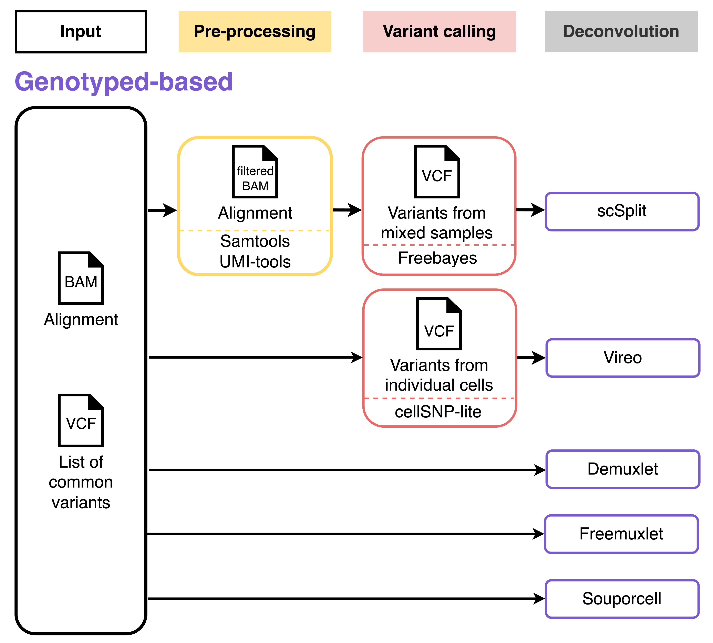

# Genetics-based deconvolution workflow

Genotyped-based deconvolution leverages the unique genetic composition of individual samples to guarantee that the final cell mixture can be deconvolved. This can be conducted with genotype of origin or in a genotype-free mode using a genomic reference from unmatched donors, for example the 1000 genome project genotypes in a genotype-free. The result of this approach is a table of SNP assignment to cells that can be used to computationally infer the donors. One limitation of this approach is the need to produce additional data to genotype the individual donors in order to correctly assign the cell mixtures.

## **Genetics-based deconvolution (gene_demulti) in hadge**

## **Input data preparation**

The input data depends heavily on the deconvolution tools. In the following table, you will find the minimal input data required by different tools.

| Deconvolution methods | Input data                                                                           |
| --------------------- | ------------------------------------------------------------------------------------ |
| Demuxlet              | - Alignment (BAM) - Barcode (TSV) - Genotype reference (VCF)                   |
| Freemuxlet            | - Alignment (BAM) - Barcode (TSV) - Genotypes from referenced population (VCF) |
| Vireo                 | - Cell genotype (VCF or cellSNP folder)                                              |
| Souporcell            | - Alignment (BAM) - Barcode (TSV) - Reference genome (FASTA)                   |
| scSplit               | - Alignment (BAM) - Barcode (TSV) - Genotypes from referenced population (VCF) |
|                       |                                                                                      |

You may see that some tools share some input data in common, so we set only one parameter for the same input for benchmarking.

| Input data                                 | Parameter                              |
| ------------------------------------------ | -------------------------------------- |
| Alignment (BAM)                            | `params.bam` `params.bai`           |
| Barcode (TSV)                              | `params.barcodes`                      |
| Genotype reference (VCF)                   | `params.vcf_donor`                     |
| Genotypes from referenced population (VCF) | `params.vcf_mixed`                     |
| Reference genome (FASTA)                   | `params.fasta` `params.fasta_index` |
| Cell genotype (VCF or cellSNP folder)      | `params.celldata`                      |

#### Pre-processing

In case you want to perform genotype-based deconvolution on pre-processed data, we provide a process in concordance with [the instruction of scSplit](https://github.com/jon-xu/scSplit). It only requires the Alignment (BAM) file as input. To specify which method is performed on the pre-processed data : set `[method]_preprocess = True`.

#### Variant calling

In case you don't have any cell genotypes or variants called from mixed samples yet, we provide two processes for variant calling.
| Variant calling methods | Input data | Parameter | Output |
|------------------------- |------------------------------------------------------------- |-------------------------------------------------------------------------- |----------------------------- |
| freebayes | - Alignment (BAM) - Reference genome (FASTA) | `params.bam` `params.bai` `params.fasta` `params.fasta_index` | Variants from mixed samples |
| cellsnp-lite | - Alignment (BAM) - Barcode (TSV) - Common SNPs (VCF) | `params.bam` `params.bai` `params.barcodes` `params.regionsVCF` | Cell genotypes |

You can have following options for `scsplit_variant`:

- `True`: activate freebayes
- Otherwise: inactivate variant calling, get the input data from `params.vcf_mixed`

You can have following options for `vireo_variant`:

- `True`: activate cellsnp
- Otherwise: inactivate variant calling, get the input data from `params.celldata`

#### Common variants

When running genotype-based deconvolution methods without genotype reference, you may need common variants from the popultion. Here we collect different sources of common variants for GRCh38 recommended by different methods.

| Method       | Paramter                   | Source                                                                    |
| ------------ | -------------------------- | ------------------------------------------------------------------------- |
| scSplit      | common_variants_scSplit    | https://melbourne.figshare.com/articles/dataset/Common_SNVS_hg38/17032163 |
| Souporcell   | common_variants_souporcell | https://github.com/wheaton5/souporcell                                    |
| Freemuxlet   | common_variants_freemuxlet | https://sourceforge.net/projects/cellsnp/files/SNPlist/                   |
| cellSNP-lite | common_variants_cellsnp    | https://sourceforge.net/projects/cellsnp/files/SNPlist/                   |

## **Output**

By default, the pipeline is run on a single sample. In this case, all pipeline output will be saved in the folder `$projectDir/$params.outdir/genetic/gene_demulti`. When running the pipeline on multiple samples, the pipeline output will be found in the folder `"$projectDir/$params.outdir/$sampleId/genetic/gene_demulti`. To simplify this, we'll refer to this folder as `$pipeline_output_folder` from now on.

### Samtools

output directory: `$pipeline_output_folder/samtools/samtools_[task_ID/sampleId]`

- `filtered.bam`: processed BAM in a way that reads with any of following patterns be removed: read quality lower than 10, being unmapped segment, being secondary alignment, not passing filters, being PCR or optical duplicate, or being supplementary alignment
- `filtered.bam.bai`: index of filtered bam
- `no_dup.bam`: processed BAM after removing duplicated reads based on UMI
- `sorted.bam`: sorted BAM
- `sorted.bam.bai`: index of sorted BAM

### cellSNP-lite

output directory: `$pipeline_output_folder/cellsnp/cellsnp_[task_ID/sampleId]`

- `cellSNP.base.vcf.gz`: a VCF file listing genotyped SNPs and aggregated AD & DP infomation (without GT)
- `cellSNP.samples.tsv`: a TSV file listing cell barcodes or sample IDs
- `cellSNP.tag.AD.mtx`: a file in mtx format, containing the allele depths of the alternative (ALT) alleles
- `cellSNP.tag.DP.mtx`: a file in mtx format, containing the sum of allele depths of the reference and alternative alleles (REF + ALT)
- `cellSNP.tag.OTH.mtx`: a file in mtx format, containing the sum of allele depths of all the alleles other than REF and ALT.
- `cellSNP.cells.vcf.gz`: a VCF file listing genotyped SNPs and AD & DP & genotype (GT) information for each cell or sample
- `params.csv`: specified parameters in the cellsnp-lite task

<<<<<<< HEAD:docs/source/genetic.md
### Freebayes
=======
- sampleId
- rna_matrix_raw
- rna_matrix_filtered
- hto_matrix_raw
- hto_matrix_filtered
- bam
- bam_index
- barcodes
- nsample
- celldata
- vcf_mixed
- vcf_donor
>>>>>>> a890059 (correction docs):docs/source/usage.md

- `${region}_${vcf_freebayes}`: a VCF file containing variants called from mixed samples in the given chromosome region

### Bcftools

output directory: `$pipeline_output_folder/bcftools/bcftools_[task_ID/sampleId]`

- `total_chroms.vcf`: a VCF containing variants from all chromosomes
- `sorted_total_chroms.vcf`: sorted VCF file
- `filtered_sorted_total_chroms.vcf`: sorted VCF file containing variants with a quality score > 30

### Demuxlet

output directory: `$pipeline_output_folder/demuxlet/demuxlet_[task_ID/sampleId]`

- `{demuxlet_out}.best`: result of demuxlet containing the best guess of the sample identity, with detailed statistics to reach to the best guess
- `params.csv`: specified parameters in the Demuxlet task

Optionally:

- `{demuxlet_out}.cel`: contains the relation between numerated barcode ID and barcode. Also, it contains the number of SNP and number of UMI for each barcoded droplet.
- `{demuxlet_out}.plp`: contains the overlapping SNP and the corresponding read and base quality for each barcode ID.
- `{demuxlet_out}.umi`: contains the position covered by each umi
- `{demuxlet_out}.var`: contains the position, reference allele and allele frequency for each SNP.

### Freemuxlet

output directory: `$pipeline_output_folder/freemuxlet/freemuxlet_[task_ID/sampleId]`

- `{freemuxlet_out}.clust1.samples.gz`: contains the best guess of the sample identity, with detailed statistics to reach to the best guess.
- `{freemuxlet_out}.clust1.vcf.gz`: VCF file for each sample inferred and clustered from freemuxlet
- `{freemuxlet_out}.lmix`: contains basic statistics for each barcode
- `params.csv`: specified parameters in the Freemuxlet task

Optionally:

- `{freemuxlet_out}.cel`: contains the relation between numerated barcode ID and barcode. Also, it contains the number of SNP and number of UMI for each barcoded droplet.
- `{freemuxlet_out}.plp`: contains the overlapping SNP and the corresponding read and base quality for each barcode ID.
- `{freemuxlet_out}.umi`: contains the position covered by each umi
- `{freemuxlet_out}.var`: contains the position, reference allele and allele frequency for each SNP.
- `{freemuxlet_out}.clust0.samples.gz`: contains the best sample identity assuming all droplets are singlets
- `{freemuxlet_out}.clust0.vcf.gz}`: VCF file for each sample inferred and clustered from freemuxlet assuming all droplets are singlets
- `{freemuxlet_out}.ldist.gz`: contains the pairwise Bayes factor for each possible pair of droplets

### Vireo

output directory: `$pipeline_output_folder/vireo/vireo_[task_ID/sampleId]`

- `donor_ids.tsv`: assignment of Vireo with detailed statistics
- `summary.tsv`: summary of assignment
- `prob_singlet.tsv.gz`: contains probability of classifing singlets
- `prob_doublet.tsv.gz`: contains probability of classifing doublets
- `GT_donors.vireo.vcf.gz`: contains estimated donor genotypes
- `filtered_variants.tsv`: a minimal set of discriminatory variants
- `GT_barcodes.png`: a figure for the identified genotype barcodes
- `fig_GT_distance_estimated.pdf`: a plog showing estimated genotype distance
- `_log.txt`: vireo log file
- `params.csv`: specified parameters in the Vireo task

### scSplit

output directory: `$pipeline_output_folder/scSplit/scsplit_[task_ID/sampleId]`

- `alt_filtered.csv`: count matrix of alternative alleles
- `ref_filtered.csv`: count matrix of reference alleles
- `scSplit_result.csv`: barcodes assigned to each of the N+1 cluster (N singlets and 1 doublet cluster), doublet marked as DBL-<n> (n stands for the cluster number), e.g SNG-0 means the cluster 0 is a singlet cluster.
- `scSplit_dist_matrix.csv`: the ALT allele Presence/Absence (P/A) matrix on distinguishing variants for all samples as a reference in assigning sample to clusters, NOT including the doublet cluster, whose sequence number would be different every run (please pay enough attention to this)
- `scSplit_dist_variants.txt`: the distinguishing variants that can be used to genotype and assign sample to clusters
- `scSplit_PA_matrix.csv`: the full ALT allele Presence/Absence (P/A) matrix for all samples, NOT including the doublet cluster, whose sequence number would be different every run (please pay enough attention to this)
- `scSplit_P_s_c.csv`: the probability of each cell belonging to each sample
- `scSplit.log`: log file containing information for current run, iterations, and final Maximum Likelihood and doublet sample
- `params.csv`: specified parameters in the scSplit task

### Souporcell

output directory: `$pipeline_output_folder/souporcell/souporcell_[task_ID/sampleId]`

- `alt.mtx`: count matrix of alternative alleles
- `ref.mtx`: count matrix of reference alleles
- `clusters.tsv`: assignment of Souporcell with the cell barcode, singlet/doublet status, cluster, log_loss_singleton, log_loss_doublet, followed by log loss for each cluster.
- `cluster_genotypes.vcf`: VCF with genotypes for each cluster for each variant in the input vcf from freebayes
- `ambient_rna.txt`: contains the ambient RNA percentage detected
- `params.csv`: specified parameters in the Souporcell task

## **Parameter**

### Demuxlet and dsc-pileup

|                     |                                                                                                                                                              |
| ------------------- | ------------------------------------------------------------------------------------------------------------------------------------------------------------ |
| demuxlet            | Whether to run Demuxlet. Default: False                                                                                                                      |
| demuxlet_preprocess | Whether to perform pre-processing on the input params.bam for demuxlet. True: Perform pre-processing. Otherwise pre-processing is not called. Default: False |
| bam                 | Input SAM/BAM/CRAM file. Must be sorted by coordinates and indexed.                                                                                          |
| bai                 | Index of Input SAM/BAM/CRAM file.                                                                                                                            |
| barcodes            | List of cell barcodes to consider.                                                                                                                           |
| tag_group           | Tag representing readgroup or cell barcodes, in the case to partition the BAM file into multiple groups. For 10x genomics, use CB Default: CB                |
| tag_UMI             | Tag representing UMIs. For 10x genomiucs, use UB. Default: UB                                                                                                |
| sm                  | List of sample IDs to compare to. Default: None (use all)                                                                                                    |
| vcf_donor           | Input VCF/BCF file, containing GT, GP or PL for donors. It also requires the AC and AN field if plp_freemuxlet=True.                                         |
| sm_list             | File containing the list of sample IDs to compare. Default: None                                                                                             |
| sam_verbose         | Verbose message frequency for SAM/BAM/CRAM. Default: 1000000                                                                                                 |
| vcf_verbose         | Verbose message frequency for VCF/BCF. Default: 10000                                                                                                        |
| skip_umi            | Do not generate [prefix].umi.gz file, which stores the regions covered by each barcode/UMI pair. Default: False                                              |
| cap_BQ              | Maximum base quality (higher BQ will be capped). Default: 40                                                                                                 |
| min_BQ              | Minimum base quality to consider (lower BQ will be skipped). Default: 13                                                                                     |
| min_MQ              | Minimum mapping quality to consider (lower MQ will be ignored). Default: 20                                                                                  |
| min_TD              | Minimum distance to the tail (lower will be ignored). Default: 0                                                                                             |
| excl_flag           | SAM/BAM FLAGs to be excluded. Default: 3844                                                                                                                  |
| min_total           | Minimum number of total reads for a droplet/cell to be considered. Default: 0                                                                                |
| min_uniq            | Minimum number of unique reads (determined by UMI/SNP pair) for a droplet/cell to be considered. Default: 0                                                  |
| min_snp             | Minimum number of SNPs with coverage for a droplet/cell to be considered. Default: 0                                                                         |
| min_umi             | Minimum number of UMIs for a droplet/cell to be considered. Default: 0                                                                                       |
| plp                 | Whether to call dsc-pileup. If set True, dsc-pileup will be called. It set False, will use SAM file to call Demuxlet. Default: False                         |
| field               | FORMAT field to extract the genotype, likelihood, or posterior from. Default: GT                                                                             |
| geno_error_offset   | Offset of genotype error rate. [error] = [offset] + [1-offset]_[coeff]_[1-r2]. Default: 0.1                                                                  |
| geno_error_coeff    | Slope of genotype error rate. [error] = [offset] + [1-offset]_[coeff]_[1-r2]. Default: 0.0                                                                   |
| r2_info             | INFO field name representing R2 value. Used for representing imputation quality. Default: R2                                                                 |
| min_mac             | Minimum minor allele frequency. Default: 1                                                                                                                   |
| min_callrate        | Minimum call rate. Default: 0.5                                                                                                                              |
| alpha               | Grid of alpha to search for. Default: 0.5                                                                                                                    |
| doublet-prior       | Prior of doublet. Default: 0.5                                                                                                                               |
| demuxlet_out        | Prefix out the demuxlet and dsc-pileup output files. Default: demuxlet_res                                                                                   |

### Freemuxlet and dsc-pileup

|                            |                                                                                                                                                                |
| -------------------------- | -------------------------------------------------------------------------------------------------------------------------------------------------------------- |
| freemuxlet                 | Whether to run Freemuxlet. Default: True                                                                                                                       |
| freemuxlet_preprocess      | Whether to perform pre-processing on the input params.bam for Freemuxlet. True: Perform pre-processing. Otherwise pre-processing is not called. Default: False |
| bam                        | Input SAM/BAM/CRAM file. Must be sorted by coordinates and indexed.                                                                                            |
| bai                        | Index of Input SAM/BAM/CRAM file.                                                                                                                              |
| barcodes                   | List of cell barcodes to consider.                                                                                                                             |
| nsample                    | Number of samples multiplexed together                                                                                                                         |
| tag_group                  | Tag representing readgroup or cell barcodes, in the case to partition the BAM file into multiple groups. For 10x genomics, use CB Default: CB                  |
| tag_UMI                    | Tag representing UMIs. For 10x genomiucs, use UB. Default: UB                                                                                                  |
| common_variants_freemuxlet | Input VCF/BCF file for dsc-pileup, containing the AC and AN field.                                                                                             |
| sm                         | List of sample IDs to compare to. Default: None (use all)                                                                                                      |
| sm_list                    | File containing the list of sample IDs to compare. Default: None                                                                                               |
| sam_verbose                | Verbose message frequency for SAM/BAM/CRAM. Default: 1000000                                                                                                   |
| vcf_verbose                | Verbose message frequency for VCF/BCF. Default: 10000                                                                                                          |
| skip_umi                   | Do not generate [prefix].umi.gz file, which stores the regions covered by each barcode/UMI pair. Default: False                                                |
| cap_BQ                     | Maximum base quality (higher BQ will be capped). Default: 40                                                                                                   |
| min_BQ                     | Minimum base quality to consider (lower BQ will be skipped). Default: 13                                                                                       |
| min_MQ                     | Minimum mapping quality to consider (lower MQ will be ignored). Default: 20                                                                                    |
| min_TD                     | Minimum distance to the tail (lower will be ignored). Default: 0                                                                                               |
| excl_flag                  | SAM/BAM FLAGs to be excluded. Default: 3844                                                                                                                    |
| min_total                  | Minimum number of total reads for a droplet/cell to be considered. Default: 0                                                                                  |
| min_uniq                   | Minimum number of unique reads (determined by UMI/SNP pair) for a droplet/cell to be considered. Default: 0                                                    |
| min_umi                    | Minimum number of UMIs for a droplet/cell to be considered. Default: 0                                                                                         |
| min_snp                    | Minimum number of SNPs with coverage for a droplet/cell to be considered. Default: 0                                                                           |
| init_cluster               | Input file containing the initial cluster information. Default: None                                                                                           |
| aux_files                  | Turn on writing auxiliary output files. Default: False                                                                                                         |
| verbose                    | Turn on verbose mode with specific verbosity threshold. 0: fully verbose, 100 : no verbose messages. Default: 100                                              |
| doublet_prior              | Prior of doublet. Default: 0.5                                                                                                                                 |
| bf_thres                   | Bayes Factor Threshold used in the initial clustering. Default: 5.41                                                                                           |
| frac_init_clust            | Fraction of droplets to be clustered in the very first round of initial clustering procedure. Default: 0.5                                                     |
| iter_init                  | Iteration for initial cluster assignment (set to zero to skip the iterations). Default: 10                                                                     |
| keep_init_missing          | Keep missing cluster assignment as missing in the initial iteration. Default: False                                                                            |
| freemuxlet_out             | Prefix out the freemuxlet and dsc-pileup output files. Default: freemuxlet_out                                                                                 |

### Vireo

|                  |                                                                                                                                                                               |
| ---------------- | ----------------------------------------------------------------------------------------------------------------------------------------------------------------------------- |
| vireo            | Whether to run Vireo. Default: True                                                                                                                                           |
| vireo_preprocess | Whether to perform pre-processing on the input params.bam for cellSNP-lite. True: Perform pre-processing. Otherwise pre-processing is not called. Default: False              |
| vireo_variant    | Whether to perform cellSNP-lite before running Vireo. True: Run cellSNP-lite. Otherwise cellSNP-lite is not called and params.celldata is used as input. Default: True        |
| celldata         | The cell genotype file in VCF format or cellSNP folder with sparse matrices.                                                                                                  |
| nsample          | Number of donors to demultiplex; can be larger than provided in vcf_donor                                                                                                     |
| vartrixData      | The cell genotype files in vartrix outputs (three/four files, comma separated): alt.mtx,ref.mtx,barcodes.tsv,SNPs.vcf.gz. This will suppress cellData argument. Default: None |
| vcf_donor        | The donor genotype file in VCF format. Default: None                                                                                                                          |
| genoTag          | The tag for donor genotype: GT, GP, PL. Default: GT                                                                                                                           |
| noDoublet        | If use, not checking doublets. Default: False                                                                                                                                 |
| nInit            | Number of random initializations, when GT needs to learn. Default: 50                                                                                                         |
| extraDonor       | Number of extra donor in pre-cluster, when GT needs to learn. Default: 0                                                                                                      |
| extraDonorMode   | Method for searching from extra donors. size: n_cell per donor; distance: GT distance between donor. Default: distance                                                        |
| forceLearnGT     | If use, treat donor GT as prior only. Default: False                                                                                                                          |
| ASEmode          | If use, turn on SNP specific allelic ratio. Default: False                                                                                                                    |
| noPlot           | If use, turn off plotting GT distance. Default: False                                                                                                                         |
| randSeed         | Seed for random initialization. Default: None                                                                                                                                 |
| cellRange        | Range of cells to process, eg. 0-10000. Default: all                                                                                                                          |
| callAmbientRNAs  | If use, detect ambient RNAs in each cell. Default: False                                                                                                                      |
| nproc            | Number of subprocesses for computing, sacrifices memory for speedups. Default: 4                                                                                              |
| vireo_out        | Dirtectory for output files. Default: vireo_out                                                                                                                               |

### scSplit

|                         |                                                                                                                                                                                                                                                            |
| ----------------------- | ---------------------------------------------------------------------------------------------------------------------------------------------------------------------------------------------------------------------------------------------------------- |
| scSplit                 | Whether to run scSplit. Default: True                                                                                                                                                                                                                      |
| scSplit_preprocess      | Whether to perform pre-processing on the input params.bam for Freebayes and scSplit. True: Perform pre-processing. Otherwise pre-processing is not called. Default: True                                                                                   |
| scSplit_variant         | Whether to perform Freebayes before running scSplit. True: run Freebayes. Otherwise freebayes is not called and params.vcf_mixed is used as input. Default: True                                                                                           |
| vcf_mixed               | VCF from mixed BAM. Default: None                                                                                                                                                                                                                          |
| bam                     | Input Mixed sample BAM.                                                                                                                                                                                                                                    |
| bai                     | Index of mixed sample BAM.                                                                                                                                                                                                                                 |
| barcodes                | Barcodes whitelist.                                                                                                                                                                                                                                        |
| tag_group               | Tag for barcode. Default: CB                                                                                                                                                                                                                               |
| common_variants_scSplit | Common SNVs for scSplit.                                                                                                                                                                                                                                   |
| nsample                 | Expected number of mixed samples.                                                                                                                                                                                                                          |
| refscSplit              | Output Ref count matrix. Default: ref_filtered.csv                                                                                                                                                                                                         |
| altscSplit              | Output Alt count matrix. Default: alt_filtered.csv                                                                                                                                                                                                         |
| subscSplit              | The maximum number of subpopulations in autodetect mode. Default: 10                                                                                                                                                                                       |
| emsscSplit              | Number of EM repeats to avoid local maximum. Default: 30                                                                                                                                                                                                   |
| dblscSplit              | Correction for doublets, Setting to 0 means you would expect no doublets. There will be no refinement on the results if this optional parameter is not specified or specified percentage is less than doublet rates detected during the run. Default: None |
| vcf_donor               | Known individual genotypes to limit distinguishing variants to available variants, so that users do not need to redo genotyping on selected variants.                                                                                                      |
| sample_geno             | Whether to generate sample genotypes based on the split result. Default: True                                                                                                                                                                              |
| scsplit_out             | Dirtectory for scSplit output files. Default: scsplit_out                                                                                                                                                                                                  |

### Souporcell

|                              |                                                                                                                                                                |
| ---------------------------- | -------------------------------------------------------------------------------------------------------------------------------------------------------------- |
| souporcell                   | Whether to run Souporcell. Default: True                                                                                                                       |
| souporcell_preprocess        | Whether to perform pre-processing on the input params.bam for Souporcell. True: Perform pre-processing. Otherwise pre-processing is not called. Default: False |
| bam                          | Cellranger bam.                                                                                                                                                |
| bai                          | Index of cellranger bam.                                                                                                                                       |
| barcodes                     | Barcodes.tsv from cellranger                                                                                                                                   |
| fasta                        | Reference fasta file.                                                                                                                                          |
| fasta_index                  | Index of reference fasta file.                                                                                                                                 |
| nsample                      | Number of clusters in the BAM file.                                                                                                                            |
| threads                      | Max threads to use. Default: 5                                                                                                                                 |
| ploidy                       | Ploidy, must be 1 or 2. Default: 2                                                                                                                             |
| min_alt                      | Min alt to use locus. Default: 10                                                                                                                              |
| min_ref                      | Min ref to use locus. Default: 10                                                                                                                              |
| max_loci                     | Max loci per cell, affects speed. Default: 2048                                                                                                                |
| restarts                     | Number of restarts in clustering, when there are > 12 clusters we recommend increasing this to avoid local minima. Default: None                               |
| common_variants_souporcell   | Common variant loci or known variant loci vcf, must be vs same reference fasta.                                                                                |
| vcf_donor                    | Known variants per clone in population vcf mode, must be VCF file.                                                                                             |
| known_genotypes_sample_names | Which samples in population vcf from known genotypes option represent the donors in your sample. Default: None                                                 |
| skip_remap                   | Don't remap with minimap2, not recommended unless in conjunction with comman variants. Default: True                                                           |
| ignore                       | Set to True to ignore data error assertions. Default: False                                                                                                    |
| souporcell_out               | Dirtectory for Souporcell output files. Default: souporcell_out                                                                                                |

### cellSNP-lite

|                         |                                                                                                                                                                                             |
| ----------------------- | ------------------------------------------------------------------------------------------------------------------------------------------------------------------------------------------- |
| bam                     | An indexed sam/bam file, comma separated multiple samples.                                                                                                                                  |
| barcodes                | A plain file listing all effective cell barcode.                                                                                                                                            |
| common_variants_cellsnp | A VCF file listing all candidate snps, for fetch each variants.                                                                                                                             |
| targetsVCF              | Similar as regionsVCF, but the next position is accessed by streaming rather than indexing/jumping. Default: None                                                                           |
| sampleList              | A list file containing sample IDs, each per line. Default: None                                                                                                                             |
| sampleIDs               | Comma separated sample ids. Default: None                                                                                                                                                   |
| genotype_cellSNP        | If use, do genotyping in addition to counting. Default: True                                                                                                                                |
| gzip_cellSNP            | If use, the output files will be zipped into BGZF format. Default: True                                                                                                                     |
| printSkipSNPs           | If use, the SNPs skipped when loading VCF will be printed. Default: False                                                                                                                   |
| nproc_cellSNP           | min alt to use locus. Default: 10                                                                                                                                                           |
| refseq_cellSNP          | Faidx indexed reference sequence file. If set, the real (genomic) ref extracted from this file would be used for Mode 2 or for the missing REFs in the input VCF for Mode 1. Default: None. |
| chrom                   | The chromosomes to use, comma separated. Default: None (1-22)                                                                                                                               |
| cellTAG                 | Tag for cell barcodes, turn off with None. Default: CB                                                                                                                                      |
| UMItag                  | Tag for UMI: UB, Auto, None. For Auto mode, use UB if barcodes are inputted, otherwise use None. None mode means no UMI but read counts. Default: Auto                                      |
| minCOUNT                | Minimum aggragated count. Default: 20                                                                                                                                                       |
| minMAF                  | Minimum minor allele frequency. Default: 0.0                                                                                                                                                |
| doubletGL               | If use, keep doublet GT likelihood. Default: False                                                                                                                                          |
| inclFLAG                | Required flags: skip reads with all mask bits unset []. Default: None                                                                                                                       |
| exclFLAG                | Filter flags: skip reads with any mask bits set [UNMAP,SECONDARY,QCFAIL (when use UMI) or UNMAP,SECONDARY,QCFAIL,DUP (otherwise)]. Default: None                                            |
| minLEN                  | Minimum mapped length for read filtering. Default: 30                                                                                                                                       |
| minMAPQ                 | Minimum MAPQ for read filtering. Default: 20                                                                                                                                                |
| maxDEPTH                | Maximum depth for one site of one file (excluding those filtered reads), avoids excessive memory usage; 0 means highest possible value. Default: 0                                          |
| countORPHAN             | If use, do not skip anomalous read pairs. Default: False                                                                                                                                    |
| cellsnp_out             | Dirtectory for cellSNP-lite output files. Default: cellSNP_out                                                                                                                              |

### Freebayes

|                                 |                                                                                                                                                                                                                                                            |
| ------------------------------- | ---------------------------------------------------------------------------------------------------------------------------------------------------------------------------------------------------------------------------------------------------------- |
| bam                             | Input BAM file to be analyzed.                                                                                                                                                                                                                             |
| bai                             | Index of input BAM file to be analyzed.                                                                                                                                                                                                                    |
| fasta                           | A reference sequence for analysis.                                                                                                                                                                                                                         |
| fasta_index                     | The index of the reference sequence for analysis.                                                                                                                                                                                                          |
| stdin                           | Read BAM input on stdin. Default: False                                                                                                                                                                                                                    |
| targets                         | Limit analysis to targets listed in the BED-format file. Default: None                                                                                                                                                                                     |
| region                          | Limit analysis to the specified chromosome region, 0-base coordinates. If set to None, all chromosomes are considered. Default: None.                                                                                                                      |
| samples                         | Limit analysis to samples listed (one per line) in the file. By default FreeBayes will analyze all samples in its input BAM files. Default: None                                                                                                           |
| populations                     | Each line of FILE should list a sample and a population which it is part of. The population-based bayesian inference model will then be partitioned on the basis of the populations. Default: None                                                         |
| cnv_map                         | Read a copy number map from the BED file. Default: None                                                                                                                                                                                                    |
| vcf_freebayes                   | Name of output VCF file, must be end with .vcf. Default: vcf_freebayes_output.vcf                                                                                                                                                                          |
| gvcf                            | Write gVCF output, which indicates coverage in uncalled regions. Default: False                                                                                                                                                                            |
| gvcf_chunk                      | When writing gVCF output emit a record for every specified number of bases. Default: None                                                                                                                                                                  |
| gvcf_dont_use_chunk             | When writing gVCF output don't emit a record for every specified number of bases. Default: None                                                                                                                                                            |
| variant_input                   | Use variants reported in VCF file as input to the algorithm. Variants in this file will included in the output even if there is not enough support in the data to pass input filters. Default: None                                                        |
| only_use_input_alleles          | Only provide variant calls and genotype likelihoods for sites and alleles which are provided in the VCF input, and provide output in the VCF for all input alleles, not just those which have support in the data. Default: False                          |
| haplotype_basis_alleles         | When specified, only variant alleles provided in this input VCF will be used for the construction of complex or haplotype alleles. Default: None                                                                                                           |
| report_all_haplotype_alleles    | At sites where genotypes are made over haplotype alleles, provide information about all alleles in output, not only those which are called. Default: False                                                                                                 |
| report_monomorphic              | Report even loci which appear to be monomorphic, and report all considered alleles, even those which are not in called genotypes. Default: False                                                                                                           |
| pvar                            | Report sites if the probability that there is a polymorphism at the site is greater than N. Default: 0.0                                                                                                                                                   |
| strict_vcf                      | Generate strict VCF format (FORMAT/GQ will be an int). Default: False                                                                                                                                                                                      |
| theta                           | The expected mutation rate or pairwise nucleotide diversity among the population under analysis. This serves as the single parameter to the Ewens Sampling Formula prior model. Default: 0.001                                                             |
| ploidy                          | Sets the default ploidy for the analysis. Default: 2                                                                                                                                                                                                       |
| pooled_discrete                 | Assume that samples result from pooled sequencing. Model pooled samples using discrete genotypes across pools. When using this flag, set --ploidy to the number of alleles in each sample or use the --cnv-map to define per-sample ploidy. Default: False |
| pooled_continuous               | Output all alleles which pass input filters, regardless of genotyping outcome or model. Default: False                                                                                                                                                     |
| use_reference_allele            | This flag includes the reference allele in the analysis as if it is another sample from the same population. Default: False                                                                                                                                |
| reference_quality               | Assign mapping quality to the reference allele at each site and base quality. Default: 100,60                                                                                                                                                              |
| no_snps                         | Ignore SNP alleles. Default: False                                                                                                                                                                                                                         |
| no_indels                       | Ignore insertion and deletion alleles. Default: True                                                                                                                                                                                                       |
| no_mnps                         | Ignore multi-nuceotide polymorphisms, MNPs. Default: True                                                                                                                                                                                                  |
| no_complex                      | Ignore complex events (composites of other classes). Default: True                                                                                                                                                                                         |
| use_best_n_alleles              | Evaluate only the best N SNP alleles, ranked by sum of supporting quality scores. Set to 0 to use all. Default: 0                                                                                                                                          |
| haplotype_length                | Allow haplotype calls with contiguous embedded matches of up to this length. Set N=-1 to disable clumping. Default: 3                                                                                                                                      |
| min_repeat_size                 | When assembling observations across repeats, require the total repeat length at least this many bp. Default: 5                                                                                                                                             |
| min_repeat_entropy              | To detect interrupted repeats, build across sequence until it has entropy > N bits per bp. Set to 0 to turn off. Default: 1                                                                                                                                |
| no_partial_observations         | Exclude observations which do not fully span the dynamically-determined detection window. Default: None, to use all observations, dividing partial support across matching haplotypes when generating haplotypes.                                          |
| dont_left_align_indels          | Turn off left-alignment of indels, which is enabled by default. Default: False                                                                                                                                                                             |
| use_duplicate_reads             | Include duplicate-marked alignments in the analysis. Default: False, to exclude duplicates marked as such in alignments                                                                                                                                    |
| min_mapping_quality             | Exclude alignments from analysis if they have a mapping quality less than Q. Default: 1                                                                                                                                                                    |
| min_base_quality                | Exclude alleles from analysis if their supporting base quality is less than Q. Default: 1                                                                                                                                                                  |
| min_supporting_allele_qsum      | Consider any allele in which the sum of qualities of supporting observations is at least Q. Default: 0                                                                                                                                                     |
| min_supporting_mapping_qsum     | Consider any allele in which and the sum of mapping qualities of supporting reads is at least Q. Default: 0                                                                                                                                                |
| mismatch_base_quality_threshold | Count mismatches toward --read-mismatch-limit if the base quality of the mismatch is >= Q. Default: 10                                                                                                                                                     |
| read_mismatch_limit             | Exclude reads with more than N mismatches where each mismatch has base quality >= mismatch-base-quality-threshold. Default: None, ~unbounded                                                                                                               |
| read_max_mismatch_fraction      | Exclude reads with more than N [0,1] fraction of mismatches where each mismatch has base quality >= mismatch-base-quality-threshold. Default: 1.0                                                                                                          |
| read_snp_limit                  | Exclude reads with more than N base mismatches, ignoring gaps with quality >= mismatch-base-quality-threshold. Default: None, ~unbounded                                                                                                                   |
| read_indel_limit                | Exclude reads with more than N separate gaps. Default: None, ~unbounded                                                                                                                                                                                    |
| standard_filters                | Use stringent input base and mapping quality filters equivalent to -m 30 -q 20 -R 0 -S 0. Default: False                                                                                                                                                   |
| min_alternate_fraction          | Require at least this fraction of observations supporting an alternate allele within a single individual in in order to evaluate the position. Default: 0.05                                                                                               |
| min_alternate_count             | Require at least this count of observations supporting an alternate allele within a single individual in order to evaluate the position. Default: 2                                                                                                        |
| min_alternate_qsum              | Require at least this sum of quality of observations supporting an alternate allele within a single individual in order to evaluate the position. Default: 0                                                                                               |
| min_alternate_total             | Require at least this count of observations supporting an alternate allele within the total population in order to use the allele in analysis. Default: 1                                                                                                  |
| min_coverage                    | Require at least this coverage to process a site. Default: 0                                                                                                                                                                                               |
| max_coverage                    | Do not process sites with greater than this coverage. Default: None, no limit                                                                                                                                                                              |
| no_population_priors            | Equivalent to --pooled-discrete --hwe-priors-off and removal of Ewens Sampling Formula component of priors. Default: False                                                                                                                                 |
| hwe_priors_off                  | Disable estimation of the probability of the combination arising under HWE given the allele frequency as estimated by observation frequency. Default: False                                                                                                |
| binomial_obs_priors_off         | Disable incorporation of prior expectations about observations. Uses read placement probability, strand balance probability, and read position (5'-3') probability. Default: False                                                                         |
| allele_balance_priors_off       | Disable use of aggregate probability of observation balance between alleles as a component of the priors. Default: False                                                                                                                                   |
| observation_bias                | Read length-dependent allele observation biases from the file. Default: None                                                                                                                                                                               |
| base_quality_cap                | Limit estimated observation quality by capping base quality at Q. Default: None                                                                                                                                                                            |
| prob_contamination              | An estimate of contamination to use for all samples. Default: 10e-9                                                                                                                                                                                        |
| legacy_gls                      | Use legacy (polybayes equivalent) genotype likelihood calculations. Default: False                                                                                                                                                                         |
| contamination_estimates         | A file containing per-sample estimates of contamination, such as those generated by VerifyBamID. Default: None                                                                                                                                             |
| report_genotype_likelihood_max  | Report genotypes using the maximum-likelihood estimate provided from genotype likelihoods. Default: False                                                                                                                                                  |
| genotyping_max_iterations       | Iterate no more than N times during genotyping step. Default: 1000                                                                                                                                                                                         |
| genotyping_max_banddepth        | Integrate no deeper than the Nth best genotype by likelihood when genotyping. Default: 6                                                                                                                                                                   |
| posterior_integration_limits    | Integrate all genotype combinations in our posterior space which include no more than N samples with their Mth best data likelihood. Default: 1,3                                                                                                          |
| exclude_unobserved_genotypes    | Skip sample genotypings for which the sample has no supporting reads. Default: False                                                                                                                                                                       |
| genotype_variant_threshold      | Limit posterior integration to samples where the second-best genotype likelihood is no more than log(N) from the highest genotype likelihood for the sample. Default: None, ~unbounded                                                                     |
| use_mapping_quality             | Use mapping quality of alleles when calculating data likelihoods. Default: False                                                                                                                                                                           |
| harmonic_indel_quality          | Use a weighted sum of base qualities around an indel, scaled by the distance from the indel. Default: False, use a minimum BQ in flanking sequence.                                                                                                        |
| read_dependence_factor          | Incorporate non-independence of reads by scaling successive observations by this factor during data likelihood calculations. Default: 0.9                                                                                                                  |
| genotype_qualities              | Calculate the marginal probability of genotypes and report as GQ in each sample field in the VCF output Default: False                                                                                                                                     |
| debug                           | Print debugging output. Default: False                                                                                                                                                                                                                     |
| dd                              | Print more verbose debugging output (requires "make DEBUG"). Default: False                                                                                                                                                                                |
