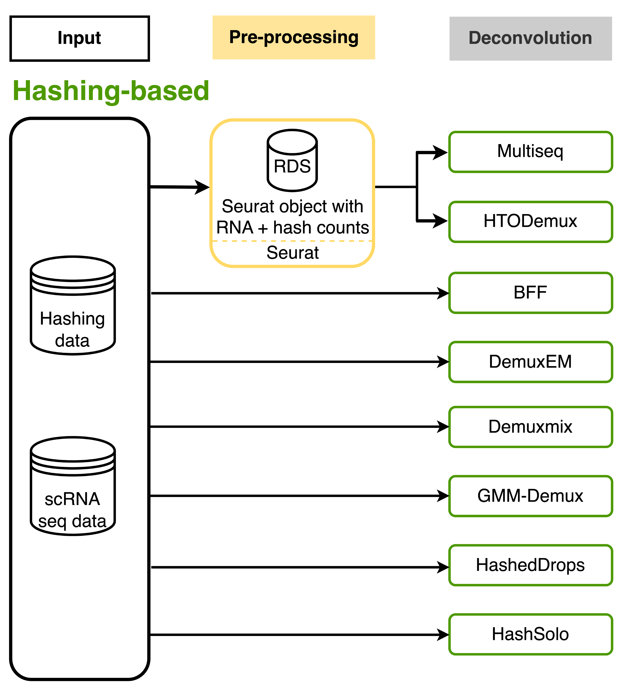

# Hashing demultiplexing

Cell hashing is a sample processing technique that requires processing individual samples to “tag” the membrane of the cell or the nuclei with unique oligonucleotide barcodes. The cells are then washed or the reaction is quenched, and the samples can be safely mixed and processed following the standard library preparation procedure. Two libraries are generated after this process, one for the scRNA and one for the hashing oligos (HTO), which are independently sequenced to produce each a single cell count matrix, one for the RNA library and one for the HTO library. The hashtag counts are then bioinformatically processed to deconvolve the cell’s source sample.

## **Hashing-based deconvolution (hash_demulti) in hadge**



## **Quick start**

```bash
cd hadge
nextflow run main.nf -profile test --mode hashing
```

## **Input data preparation**

The input data depends heavily on the deconvolution tools. In the following table, you will find the minimal input data required by different tools.

| Deconvolution method | Input data                                                                                                         | Parameter                                                      |
| -------------------- | ------------------------------------------------------------------------------------------------------------------ | -------------------------------------------------------------- |
| HTODemux             | - Seurat object with both UMI and hashing count matrix (RDS)                                                       | `params.rna_matrix_htodemux` <br> `params.hto_matrix_htodemux` |
| Multiseq             | - Seurat object with both UMI and hashing count matrix (RDS)                                                       | `params.rna_matrix_multiseq` <br> `params.hto_matrix_multiseq` |
| HashSolo             | - 10x mtx directory with hashing count matrix (H5)                                                                 | `params.hto_matrix_hashsolo` <br> `params.rna_matrix_hashsolo` |
| HashedDrops          | - 10x mtx directory with hashing count matrix (Directory)                                                          | `params.hto_matrix_hashedDrops`                                |
| Demuxem              | - 10x mtx directory with UMI count matrix (Directory) <br>- 10x mtx directory with hashing count matrix (Directory) | `params.hto_matrix_demuxem`<br>`params.rna_matrix_demuxem`     |
| GMM - Demux              | - 10x mtx directory with UMI count matrix (Directory)<br> - 10x mtx directory with hashing count matrix (Directory) | `params.hto_matrix_gmm_demux`    |
| BFF             | - 10x mtx directory with UMI count matrix (Directory)<br>- 10x mtx directory with hashing count matrix (Directory) | `params.hto_matrix_bff`     |


Similary as genotype-based deconvlution methods, hashing methods also have some input in common. So we also try to utilize common input parameters `params.[rna/hto]_matrix_[raw/filtered]` to store count matrices for better control and `params.[rna/hto]_matrix_[method]` is used to specify whether to use raw or filtered counts for each method.

| Input data                     | Parameter                    |
| ------------------------------ | ---------------------------- |
| Raw scRNAseq count matrix      | `params.rna_matrix_raw`      |
| Filtered scRNAseq count matrix | `params.rna_matrix_filtered` |
| Raw HTO count matrix           | `params.hto_matrix_raw`      |
| Filtered HTO count matrix      | `params.hto_matrix_filtered` |

#### Pre-processing

Similar as in the genetic demultiplexing workflow, we provide a pre-processing step required before running HTODemux and Multiseq to load count matrices into a Seurat object. The input will be automatically loaded from the parameters set above.

## **Output**

By default, the pipeline is run on a single sample. In this case, all pipeline output will be saved in the folder `$projectDir/$params.outdir/hashing/hash_demulti`. When running the pipeline on multiple samples, the pipeline output will be found in the folder `"$projectDir/$params.outdir/$sampleId/hashing/hash_demulti`. To simplify this, we'll refer to this folder as `$pipeline_output_folder` from now on.

### Pre-processing

output directory: `$pipeline_output_folder/preprocess/preprocess_[task_ID/sampleId]`

- `${params.preprocessOut}.rds`: pre-processed data in an RDS object
- `params.csv`: specified parameters in the hashing pre-processing task

### HTODemux

output directory: `$pipeline_output_folder/htodemux/htodemux_[task_ID/sampleId]`

- `${params.assignmentOutHTO}_assignment_htodemux.csv`: the assignment of HTODemux
- `${params.assignmentOutHTO}_classification_htodemux.csv`: the classification of HTODemux as singlet, doublet and negative droplets
- `${params.objectOutHTO}.rds`: the result of HTODemux in an RDS object
- `params.csv`: specified parameters in the HTODemux task

Optionally:

- `ridge.jpeg`: a ridge plot showing the enrichment of selected HTOs
- `featureScatter.jpeg`: a scatter plot showing the signal of two selected HTOs
- `violinPlot.jpeg`: a violin plot showing selected features
- `tSNE.jpeg`: a 2D plot based on tSNE embedding of HTOs
- `heatMap.jpeg`: a heatmap of hashtag oligo signals across singlets, doublets and negative cells
- `visual_params.csv`: specified parameters for visualisation of the HTODemux result

### Multiseq

output directory: `$pipeline_output_folder/multiseq/multiseq_[task_ID/sampleId]`

- `${params.assignmentOutMulti}_res.csv`: the assignment of Multiseq
- `${params.objectOutMulti}.rds`: the result of Multiseq in an RDS object
- `params.csv`: specified parameters in the Multiseq task

### Demuxem

output directory: `$pipeline_output_folder/demuxem/demuxem_[task_ID/sampleId]`

- `${params.objectOutDemuxem}_demux.zarr.zip`: RNA expression matrix with demultiplexed sample identities in Zarr format
- `${params.objectOutDemuxem}.out.demuxEM.zarr.zip`: DemuxEM-calculated results in Zarr format, containing two datasets, one for HTO and one for RNA
- `${params.objectOutDemuxem}.ambient_hashtag.hist.pdf`: A histogram plot depicting hashtag distributions of empty droplets and non-empty droplets
- `${params.objectOutDemuxem}.background_probabilities.bar.pdf}`: A bar plot visualizing the estimated hashtag background probability distribution
- `${params.objectOutDemuxem}.real_content.hist.pdf`: A histogram plot depicting hashtag distributions of not-real-cells and real-cells as defined by total number of expressed genes in the RNA assay
- `${params.objectOutDemuxem}.rna_demux.hist.pdf`: This figure consists of two plots. The first one is a horizontal bar plot depicting the percentage of RNA barcodes with at least one HTO count. The second plot is a histogram plot depicting RNA UMI distribution for singlets, doublets and unknown cells.
- `${params..objectOutDemuxem}.gene_name.violin.pdf`: Violin plots depicting gender-specific gene expression across samples.
- `${params.objectOutDemuxem}_summary.csv`: the classification of Demuxem
- `${params.objectOutDemuxem}_obs.csv`: the assignment of Demuxem
- `params.csv`: specified parameters in the Demuxem task

Optionally:

- `{params.objectOutDemuxem}.{gene_name}.violin.pdf`: violin plots using specified gender-specific gene

### HashSolo

output directory: `$pipeline_output_folder/hashsolo/hashsolo_[task_ID/sampleId]`

- `${params.assignmentOutHashSolo}_res.csv`: the assignment of HashSolo
- `${params.plotOutHashSolo}.jpg`: plot of HashSolo demultiplexing results for QC checks
- `params.csv`: specified parameters in the HashSolo task

### HashedDrops

output directory: `$pipeline_output_folder/hashedDrops/hashedDrops_[task_ID/sampleId]`

- `${params.objectOutEmptyDrops}.rds`: the result of emptyDrops in an RDS object
- `${params.assignmentOutEmptyDrops}.csv`: the result of emptyDrops in a csv file
- `plot_emptyDrops.png`: a diagnostic plot comparing the total count against the negative log-probability
- `${params.objectOutHashedDrops}.rds`: the result of hashedyDrops in an RDS object
- `${params.assignmentOutHashedDrops}_res.csv`: the assignment of HashSolo
- `${params.objectOutHashedDrops}_LogFC.png`: a diagnostic plot comparing the log-fold change between the second HTO's abundance and the ambient contamination
- `params.csv`: specified parameters in the HashedDrops task


### GMM-Demux

output directory: `$pipeline_output_folder/gmm_demux/gmm_demux_[task_ID/sampleId]`

- `features.tsv.gz`: default content in the output folder are the non-MSM droplets (SSDs), stored in MTX format.
- `barcodes.tsv.gz`: default content in the output folder are the non-MSM droplets (SSDs), stored in MTX format.
- `matrix.mtx.gz`: default content in the output folder are the non-MSM droplets (SSDs), stored in MTX format.
- `GMM_full.csv`: The classification file containing the label of each droplet as well as the probability of the classification.
- `GMM_full.config`: Used to assign each classification to a donor using the numbers listed in the config file
- `gmm_demux_${task.index}_report.txt`: Specify the file to store summary report, produced only if GMM can find a viable solution that satisfies the droplet formation model
- `params.csv`: specified parameters in the GMM-Demux task

### BFF

output directory: `$pipeline_output_folder/bff/bff_[task_ID/sampleId]`

- `${params.assignmentOutBff}_assignment_bff.csv`: the assignment and classification results produced by BFF
- `params.csv`: specified parameters in the BFF task

## **Parameter**

### Preprocessing

|               |                                                                                                 |
| ------------- | ----------------------------------------------------------------------------------------------- |
| ndelim        | For the initial identity calss for each cell, delimiter for the cell's column name. Default: \_ |
| sel_method    | The selection method used to choose top variable features. Default: mean.var.plot               |
| n_features    | Number of features to be used when finding variable features. Default: 2000                     |
| assay         | Assay name for HTO modality. Default: HTO                                                       |
| norm_method   | Method for normalization of HTO data. Default: CLR                                              |
| margin        | If performing CLR normalization, normalize across features (1) or cells (2). Default: 2         |
| preprocessOut | Name of the output Seurat object. Default: preprocessed                                         |

### HTODemux

|                     |                                                                                                                                |
| ------------------- | ------------------------------------------------------------------------------------------------------------------------------ |
| htodemux            | Whether to perform Multiseq. Default: True                                                                                     |
| rna_matrix_htodemux | Whether to use raw or filtered scRNA-seq count matrix. Default: filtered                                                       |
| hto_matrix_htodemux | Whether to use raw or filtered HTO count matrix. Default: filtered                                                             |
| assay               | Name of the hashtag assay. Default: HTO                                                                                        |
| quantile_htodemux   | The quantile of inferred 'negative' distribution for each hashtag, over which the cell is considered 'positive'. Default: 0.99 |
| kfunc               | Clustering function for initial hashtag grouping. Default: clara.                                                              |
| nstarts             | nstarts value for k-means clustering when kfunc=kmeans. Default: 100                                                           |
| nsamples            | Number of samples to be drawn from the dataset used for clustering when kfunc= clara. Default: 100                             |
| seed                | Sets the random seed. Default: 42                                                                                              |
| init                | Initial number of clusters for hashtags. Default: None, which means the # of hashtag oligo names + 1 to account for negatives. |
| objectOutHTO        | Name of the output Seurat object. Default: htodemux                                                                            |
| assignmentOutHTO    | Prefix of the output CSV files. Default: htodemux                                                                              |
| ridgePlot           | Whether to generate a ridge plot to visualize enrichment for all HTOs. Default: True                                           |
| ridgeNCol           | Number of columns in the ridge plot. Default: 3                                                                                |
| featureScatter      | Whether to generate a scatter plot to visualize pairs of HTO signals. Default: False                                           |
| scatterFeat1        | First feature to plot. Default: None                                                                                           |
| scatterFeat2        | Second feature to plot. Default: None                                                                                          |
| vlnplot             | Whether to generate a violin plot, e.g. to compare number of UMIs for singlets, doublets and negative cells. Default: True     |
| vlnFeatures         | Features to plot. Default: nCount_RNA                                                                                          |
| vlnLog              | Whether to plot the feature axis on log scale. Default: True                                                                   |
| tsne                | Whether to generate a 2D tSNE embedding for HTOs. Default: True                                                                |
| tsneIdents          | Subset Seurat object based on identity class. Default: Negative                                                                |
| tsneInvert          | Whether to keep or remove the identity class. Default: True                                                                    |
| tsneVerbose         | Whether to print the top genes associated with high/low loadings for the PCs when running PCA. Default: False                  |
| tsneApprox          | Whether to use truncated singular value decomposition to approximate PCA. Default: False                                       |
| tsneDimMax          | Number of dimensions to use as input features when running t-SNE dimensionality reduction. Default: 2                          |
| tsnePerplexity      | Perplexity when running t-SNE dimensionality reduction. Default: 100                                                           |
| heatmap             | Whether to generate an HTO heatmap. Default: True                                                                              |
| heatmapNcells       | Number of cells to plot. Default: 5000                                                                                         |

### Multiseq

|                     |                                                                                                         |
| ------------------- | ------------------------------------------------------------------------------------------------------- |
| multiseq            | Whether to perform Multiseq. Default: True                                                              |
| rna_matrix_multiseq | Whether to use raw or filtered scRNA-seq count matrix. Default: filtered                                |
| hto_matrix_multiseq | Whether to use raw or filtered HTO count matrix. Default: filtered                                      |
| assay               | Name of the hashtag assay, same as used for HTODemux. Default: HTO                                      |
| quantile_multi      | The quantile to use for classification. Default: 0.7                                                    |
| autoThresh          | Whether to perform automated threshold finding to define the best quantile. Default: True               |
| maxiter             | nstarts value for k-means clustering when kfunc=kmeans. Default: 100                                    |
| qrangeFrom          | The minimal possible quantile value to try if autoThresh=True. Default: 0.1                             |
| qrangeTo            | The minimal possible quantile value to try if autoThresh=True. Default: 0.9                             |
| qrangeBy            | The constant difference of a range of possible quantile values to try if autoThresh=True. Default: 0.05 |
| verbose_multiseq    | Wether to print the output. Default: True                                                               |
| assignmentOutMulti  | Prefix of the output CSV files. Default: multiseq                                                       |
| objectOutMulti      | Name of the output Seurat object. Default: multiseq                                                     |

### Solo

|                            |                                                                                                  |
| -------------------------- | ------------------------------------------------------------------------------------------------ |
| solo                       | Whether to perform Solo. Default: True                                                           |
| rna_matrix_solo            | Input folder to RNA expression matrix in 10x format.                                             |
| max_epochs                 | Number of epochs to train for. Default: 400                                                      |
| lr                         | Learning rate for optimization. Default: 0.001                                                   |
| train_size                 | Size of training set in the range between 0 and 1. Default: 0.9                                  |
| validation_size            | Size of the test set. Default: 0.1                                                               |
| batch_size                 | Minibatch size to use during training. Default: 128                                              |
| early_stopping             | Adds callback for early stopping on validation_loss. Default: True                               |
| early_stopping_patience    | Number of times early stopping metric can not improve over early_stopping_min_delta. Default: 30 |
| early_stopping_min_delta   | Threshold for counting an epoch towards patience train(). Default: 10                            |
| soft                       | Return probabilities instead of class label. Default: False                                      |
| include_simulated_doublets | Return probabilities for simulated doublets as well.                                             |
| assignmentOutSolo          | Prefix of the output CSV files. Default: solo_predict                                            |

### HashSolo

|                          |                                                                                              |
| ------------------------ | -------------------------------------------------------------------------------------------- |
| hashsolo                 | Whether to perform HashSolo. Default: True                                                   |
| rna_matrix_hashsolo      | Whether to use raw or filtered scRNA-seq count matrix. Default: raw                          |
| hto_matrix_hashsolo      | Whether to use raw or filtered HTO count matrix if use_rna_data is set to True. Default: raw |
| priors_negative          | Prior for the negative hypothesis. Default: 1/3                                              |
| priors_singlet           | Prior for the singlet hypothesis. Default: 1/3                                               |
| priors_doublet           | Prior for the doublet hypothesis. Default: 1/3                                               |
| pre_existing_clusters    | Column in the input data for how to break up demultiplexing. Default: None                   |
| use_rna_data             | Whether to use RNA counts for deconvolution. Default: False                                  |
| number_of_noise_barcodes | Number of barcodes to use to create noise distribution. Default: None                        |
| assignmentOutHashSolo    | Prefix of the output CSV files. Default: hashsolo                                            |
| plotOutHashSolo          | Prefix of the output figures. Default: hashsolo                                              |

### DemuxEm

|                      |                                                                                                                               |
| -------------------- | ----------------------------------------------------------------------------------------------------------------------------- |
| demuxem              | Whether to perform Demuxem. Default: True                                                                                     |
| rna_matrix_demuxem   | Whether to use raw or filtered scRNA-seq count matrix. Default: raw                                                           |
| hto_matrix_demuxem   | Whether to use raw or filtered HTO count matrix. Default: raw                                                                 |
| threads_demuxem      | Number of threads to use. Must be a positive integer. Default: 1                                                              |
| alpha_demuxem        | The Dirichlet prior concentration parameter (alpha) on samples. An alpha value < 1.0 will make the prior sparse. Default: 0.0 |
| alpha_noise          | The Dirichlet prior concenration parameter on the background noise. Default: 1.0                                              |
| min_num_genes        | Filter cells/nuclei with at least specified number of expressed genes. Default: 100                                           |
| min_num_umis         | Filter cells/nuclei with at least specified number of UMIs. Default: 100                                                      |
| min_signal           | Any cell/nucleus with less than min_signal hashtags from the signal will be marked as unknown. Default: 10                    |
| tol                  | Threshold used for the EM convergence. Default: 1e-6                                                                          |
| generate_gender_plot | Generate violin plots using gender-specific genes (e.g. Xist). Value is a comma-separated list of gene names. Default: None   |
| random_state         | Random seed set for reproducing results. Default: 0                                                                           |
| objectOutDemuxem     | Prefix of the output files. Default: demuxem_res                                                                              |

### HashedDrops

|                          |                                                                                                                                                                                                            |
| ------------------------ | ---------------------------------------------------------------------------------------------------------------------------------------------------------------------------------------------------------- |
| hashedDrops              | Whether to perform hashedDrops. Default: True                                                                                                                                                              |
| hto_matrix_hashedDrops   | Whether to use raw or filtered HTO count matrix. Default: raw                                                                                                                                              |
| lower                    | The lower bound on the total UMI count, at or below which all barcodes are assumed to correspond to empty droplets. Default: 100                                                                           |
| niters                   | The number of iterations to use for the Monte Carlo p-value calculations. Default: 10000                                                                                                                   |
| testAmbient              | Whether results should be returned for barcodes with totals less than or equal to lower. Default: True                                                                                                     |
| ignore_hashedDrops       | The lower bound on the total UMI count, at or below which barcodes will be ignored. Default: None                                                                                                          |
| alpha_hashedDrops        | The scaling parameter for the Dirichlet-multinomial sampling scheme. Default: None                                                                                                                         |
| round                    | Whether to check for non-integer values in m and, if present, round them for ambient profile estimation. Default: True                                                                                     |
| byRank                   | If set, this is used to redefine lower and any specified value for lower is ignored. Default: None                                                                                                         |
| isCellFDR                | FDR Threshold to filter the cells for empty droplet detection. Default: 0.01                                                                                                                               |
| objectOutEmptyDrops      | Prefix of the emptyDroplets output RDS object. Default: emptyDroplets                                                                                                                                      |
| assignmentOutEmptyDrops  | Prefix of the emptyDroplets output CSV file. Default: emptyDroplets                                                                                                                                        |
| ambient                  | Whether to use the relative abundance of each HTO in the ambient solution from emptyDrops, set True only when testAmbient=True. Default: False                                                             |
| minProp                  | The ambient profile when ambient=None. Default: 0.05                                                                                                                                                       |
| pseudoCount              | The minimum pseudo-count when computing logfold changes. Default: 5                                                                                                                                        |
| constantAmbient          | Whether a constant level of ambient contamination should be used to estimate LogFC2 for all cells. Default: False                                                                                          |
| doubletNmads             | The number of median absolute deviations (MADs) to use to identify doublets. Default: 3                                                                                                                    |
| doubletMin               | The minimum threshold on the log-fold change to use to identify doublets. Default: 2                                                                                                                       |
| doubletMixture           | Wwhether to use a 2-component mixture model to identify doublets. Default: False                                                                                                                           |
| confidentNmads           | The number of MADs to use to identify confidently assigned singlets. Default: 3                                                                                                                            |
| confidenMin              | The minimum threshold on the log-fold change to use to identify singlets. Default: 2                                                                                                                       |
| combinations             | An integer matrix specifying valid combinations of HTOs. Each row corresponds to a single sample and specifies the indices of rows in x corresponding to the HTOs used to label that sample. Default: None |
| objectOutHashedDrops     | Prefix of the hashedDrops output RDS object. Default: hashedDrops                                                                                                                                          |
| assignmentOutHashedDrops | Prefix of the hashedDrops output CSV file. Default: hashedDrops                                                                                                                                            |
### GMM-Demux
|                          |                                                                                              |
| ------------------------ | -------------------------------------------------------------------------------------------- |
| gmmDemux                 | Whether to perform GMMDemux. Default: True                                                   |
| hto_matrix_gmm_demux      | Whether to use raw or filtered HTO count matrix. Default: filtered                                                            |
| assignmentOutGmmDemux      | Name for the folder output. Default: gmm_demux|
| hto_name_gmm          |   list of sample tags (HTOs) separated by ',' without whitespace. Default: None   |
| summary           |  the estimated total count of cells in the single cell assay. Default: 2000     |
| report_gmm           | Name for the file generated by the summary. Default:report.txt            |
| mode_GMM    | Format of the input, either tsv or csv. Default: tsv                 |
| extract             | extract names of the sample barcoding tag(s) to extract, separated by ','. Joint tags are linked with '+'.  Default: None       |
| threshold_gmm | Provide the confidence threshold value. Requires a float in (0,1). Default: 0.8    |
| ambiguous    | The estimated chance of having a phony GEM getting included in a pure type GEM cluster by the clustering algorithm. Default: 0.5.            |
| plotOutHashSolo          | Prefix of the output figures. Default: hashsolo                                              |

### BFF
|                          |                                                                                              |
| ------------------------ | -------------------------------------------------------------------------------------------- |
| BFF                 | Whether to perform BFF. Default: False                                                   |
| hto_matrix_bff      | Whether to use raw or filtered HTO count matrix. Default: raw                                                            |
| rna_matrix_bff   | Whether to use raw or filtered scRNA-seq count matrix. Default: raw                                                           |
| assignmentOutBff      | Name for the folder output. Default: bff|
| methods          |   method or list of methods to be used. Default: combined_bff   |
| methodsForConsensus           | a consensus call will be generated using all methods especified. Default: NULL   |
| cellbarcodeWhitelist           | 	A vector of expected cell barcodes. Default:NULL            |
| metricsFile    | summary metrics will be written to this file. Default: metrics_bff.cvs                 |
| doTSNE             |  tSNE will be run on the resulting hashing calls after each caller.  Default: True       |
| doHeatmap | if true, Seurat::HTOHeatmap will be run on the results of each calle Default: True   |
| perCellSaturation    | An optional dataframe with the columns cellbarcode and saturation. Default: NULL            |
| majorityConsensusThreshold | This applies to calculating a consensus call when multiple algorithms are used. Default: NULL    |
| chemistry     | This string is passed to EstimateMultipletRate. Should be either 10xV2 or 10xV3. Default: 10xV3      |
| callerDisagreementThreshold     | If provided, the agreement rate will be calculated between each caller and the simple majority call, ignoring discordant and no-call cells. Default: NULL      |
| preprocess_bff     | When True, the data is preprocess using the method ProcessCountMatrix from CellHashR. Default: False    |
| barcodeWhitelist     | A vector of barcode names to retain. This parameter is used only when the pre-processing step is executed. Default: NULL    |


### General Use

#### Single sample use
The use of the pipeline for a single samples require the definition of certain parameters in order to run the tools under default configuration.
The parameter `--mode hashing` must be included with the purpose of running the hashing tools only.
##### GMM-Demux
The names of the hashtags must be given as a list of string, separated by ','. This list is given under the parameter `--hto_name_gmm`
##### BFF
The demultiplexing method for the experiment must be given under the parameter `--methods`. Multiple methods can be given as a list, separated by ','. 
Besides, the method or methods for consensus must be given under the parameter `--methodsForConsensus`. 


```bash
nextflow run main.nf --mode hashing --match_donor False  --hto_matrix_raw /data_folder/raw_hto_data 
--hto_matrix_filtered /data_folder/filtered_hto_data --barcodes /data_folder/filtered_hto_data/barcodes.tsv.gz --rna_matrix_raw /data_folder/raw_rna_data --rna_matrix_filtered /data_folder/filtered_rna_data --hto_name_gmm "hto_name_1,hto_name_2,hto_name_3" --methods bff_cluster  --methodsForConsensus bff_cluster
```